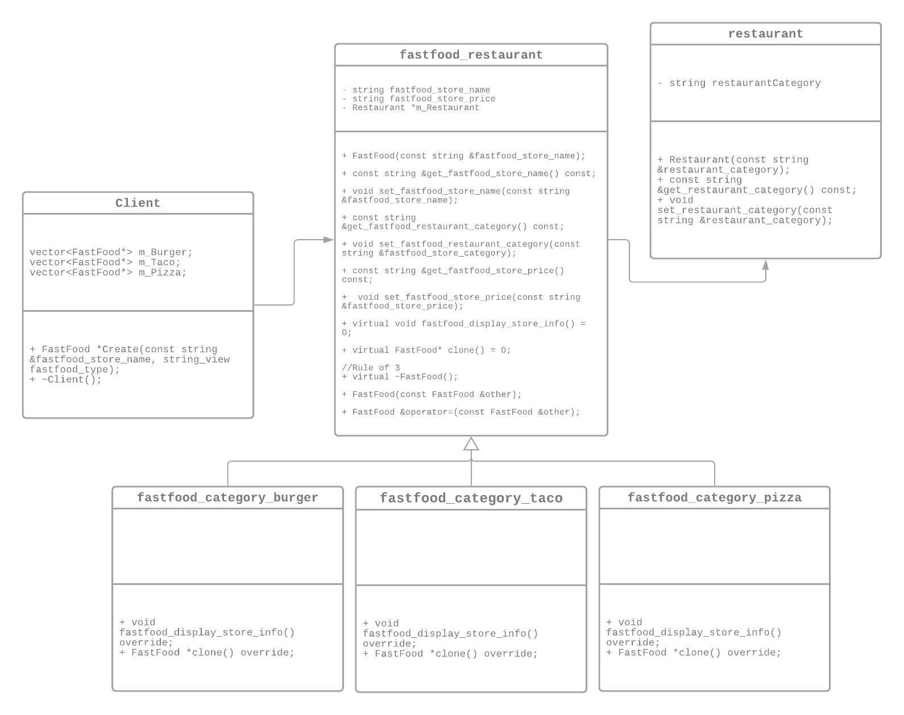
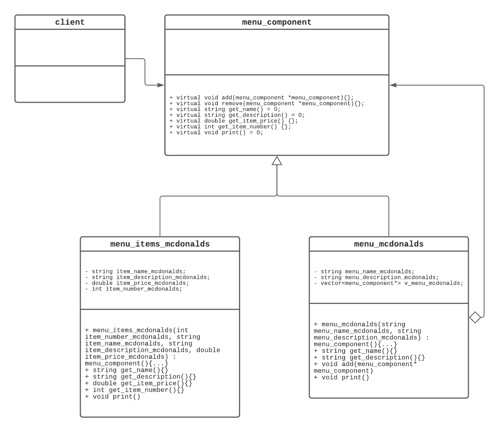
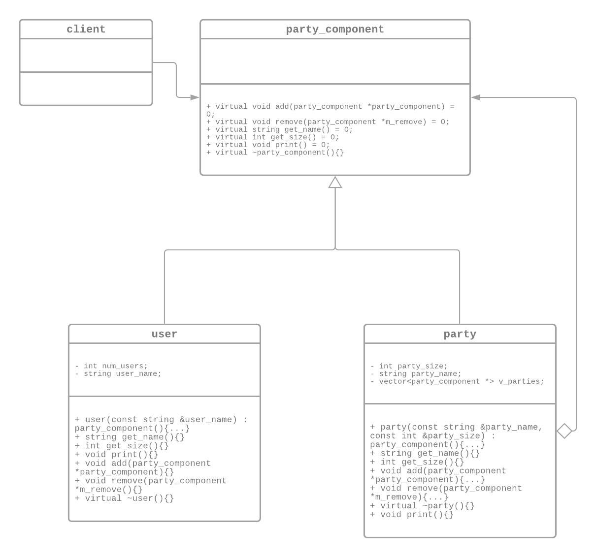
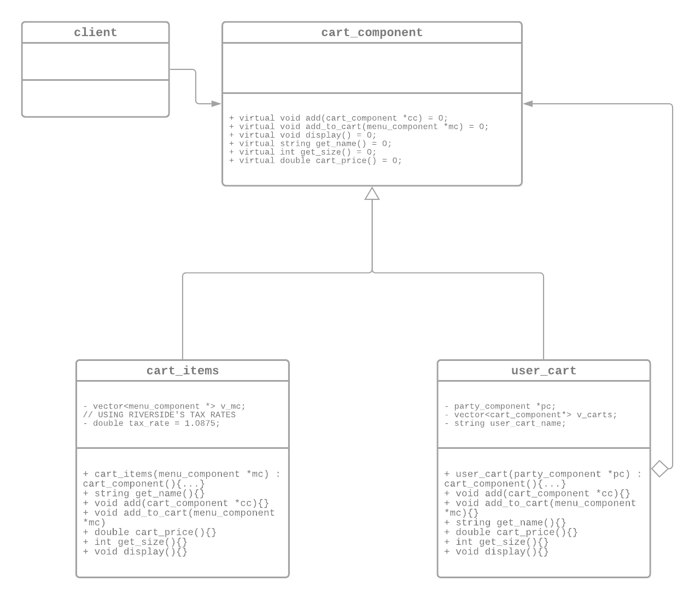

# CS100 SPLICE PROJECT
> Authors: [*Xin Wang*](https://github.com/xinwng), [*Jeanette Oh*](https://github.com/jeanetteoh), [*Hongan Zhang*](https://github.com/hongan-z)

## Phase I: Project Description

### Why is this project interesting to us?

SPLICE is a way of simplifying everyday experiences. Our group holds the idea of efficiency and convenience to a high level so we wanted to create an easy to use application that simplifies splitting the check with friends or family. It has always been an inconvenience to split a receipt and compute the intricate mathematics when trying to figure out which person needs to pay what amount. SPLICE attempts in providing a simpler way of denoting what was ordered, by who, and how much they need to pay.  

### What languages/tools/technologies do we plan to use?

This project will be coded in C++. We understand that testing is an integral part of successfully compiling a project, therefore we will be incorporating the standard Google Unit Test Framework (gtest) in pursuance of holding our project in a higher standard of quality. In addition, by completing this project, we strive to learn the importance of teamwork through GitFlow - including branching, resolving merge conflicts, opening pull requests, discussing code, and deploying our project.

### What will be the input/output for our project?

The inputs to our project will be the party name, party size, party member names, restaurant selection, and item selections in response to menu items from the restaurant that will be outputted. We will then create a unique cart for each party member that will serve as an intermediate step to our final output, which is the exact amount each consumer needs to pay per their specific carts. 

### What design patterns will we be incorporating?
**1. Prototype**

Incorporating the prototype design pattern within our project would entail creating multiple new types of restaurants that we can clone the template from. It would allow us to create copies of existing objects, and also modify it to our needs. As we are going to include numerous different restaurants, cloning each object would be more efficient and less expensive as opposed to creating new objects. For the purpose of this project, there will be no APIs utilized, and therefore we have decided to only implement 9 fastfood restaurants that fall into 3 categories: burgers, pizzas, and tacos. 

**2. Composite**

As the composite design pattern would allow us to treat individual objects in an uniformed manner. We have utilized this pattern for constructing the menu and its menu items, the parties and the party members, and lastly, linking the party members with their respective carts.

###### 2a. Constructing the menu and the menu items for different restaurants
As all ```menus (container)``` contain different ```menu items (leaf)```, the ```menu component (interface)``` will provide common specific operations that will delegate the work to the respective location in the hierarchy. For example, when constructing the menu and its items, the ```menu_component``` should successfully recognize the difference between what is a menu versus what is a menu item in our client. 

```c++
menu_component *mcdonalds_menu_customer_favorites = new menu_mcdonalds("McDonald's Menu, Customer Favorites", "Following Options are the Most Popular Items at McDonald's");
menu_component *big_mac = new menu_items_mcdonalds(1, "Big Mac", "Mouthwatering perfection starts with two 100% pure beef patties and Big Mac sauce sandwiched between a sesame seed bun. It’s topped off with pickles, crisp shredded lettuce, finely chopped onion and American cheese.", 3.99);
```
This should yield the output:
```
Menu Name: McDonald's Menu, Customer Favorites
Menu Description: Following Options are the Most Popular Items at McDonald's

Item Number: 1
Item Name: Big Mac
Item Description: Mouthwatering perfection starts with two 100% pure beef patties and Big Mac sauce sandwiched between a sesame seed bun. It’s topped off with pickles, crisp shredded lettuce, finely chopped onion and American cheese.
Item Price: 3.99
```

###### 2b. Constructing the parties and the party members
By utilizing the composite pattern to create the ```parties (container)```, and the ```party members (leaves)``` - we have constructed a ```party_component (interface)``` that successfully recognizes whether we are creating new parties or new party members. A snippet of how we utilized this portion of the composite pattern within our client is:

```c++
party_component *m_party_1 = new party("Party of 3", 3);
party_component *user_1 = new user("Xin");
party_component *user_2 = new user("Jeanette");
party_component *user_3 = new user("Hongan");
```

By calling ```m_party_1->print()```, the composite pattern should successfully display all of the party details.

```
Party Name: Party of 3
Party Size: 3
User 1: Xin
User 2: Jeanette
User 3: Hongan
```

###### 2c. Constructing the user carts and their respective cart items
We had a bit of a difficulty implementing this without any redundancy as the terms users and party members are synonymous within this project. However, we were still able to utilize this in the way we originally intended. All ```users (container)``` will take in a ```party_component *``` as a parameter to recognize the user, and each user will have their individual ```cart items (leaves)``` which takes in a parameter of ```menu_component *``` to recognize the menu items. The ```cart component (interface)``` will manage the necessary operations to successfuly delegate work based on the parameter. The purpose of utilizing this composite function is for it to successfully recognize the individuality between different users and output their respective cart items based on the menu items they have selected. This composite pattern also successfuly provides a linkage to the previous two patterns. An example of how it is utilized in our client is:

```c++
menu_component *c_mcdonalds_test = new menu_mcdonalds("McDonalds Test", "\nDescription Test");
menu_component *test_1 = new menu_items_mcdonalds(1, "Test 1", "Description Test 1", 6);
menu_component *test_2 = new menu_items_mcdonalds(2, "Test 2", "Description Test 2", 4.30);
cart_component *cart_xin = new user_cart(user_xin);
cart_component *cart_items_xin = new cart_items(test_1);
cart_items_xin->add_to_cart(test_2);
```

By calling ```cart_xin->display()```, the composite pattern should successfully display all the menu items within this cart, the total price this person needs to pay with and without tax. Note that all taxes are calculated based on the city of Riverside, which is 8.75%.

```
Displaying Xin's Cart
---------------------------------
Item Number: 1
Item Name: Test 1
Item Description: Description Test 1
Item Price: 6

Item Number: 2
Item Name: Test 2
Item Description: Description Test 2
Item Price: 4.3

Price of Test 1 is: $6
Price of Test 2 is: $4.3

Total Cart Price is: $10.3
Total Cart Price (Including Tax): $11.2012
```

#### 3. Strategy
Incorporating the strategy design pattern would allow us to sort the restaurants based on the type and the name. 

## Phase II: OMT Diagrams
#### Restaurant Prototype Pattern


As stated before, the use of this pattern allows for the clonining of different Restaurant categories. This allows for the client to easily copy any object that follows such prototype interface. The "Concrete Prototypes" will be the different categories of Fast Food places such as burgers, pizzas, and tacos. The way it is utilized through is demonstrated below:

```c++
FastFood *Create(const string &fastfood_store_name, const string &fastfood_store_price, string_view fastfood_type)
{
    if (fastfood_type == "Burger")
    {
        return new Burger(fastfood_store_name);
    }
    else if (fastfood_type == "Taco")
    {
        return new Taco(fastfood_store_name);
    }
    else if (fastfood_type == "Pizza")
    {
        return new Pizza(fastfood_store_name);
    }
    return nullptr;
}
```
Based on the type of fast food category we want to implement, ```FastFood *Create(...)``` will return a new instance of the selected restaurant. The client interface is now displayed below:

```c++
    m_Burger.push_back(Create("McDonald's", "$", "Burger"));
    m_Burger.at(0)->set_fastfood_store_price("$");
    
    auto ChickFilA = m_Burger[0]->clone();
    ChickFilA->set_fastfood_store_name("Chick-Fil-A");
    ChickFilA->set_fastfood_store_price("$$");
    m_Burger.push_back(ChickFilA);

    auto InNOut = m_Burger[0]->clone();
    InNOut->set_fastfood_store_name("In-N-Out");
    InNOut->set_fastfood_store_price("$");
    m_Burger.push_back(InNOut);
```

This would yield an output of:

```
Burger Places
===============
1. Restaurant Name: McDonald's
Restaurant Category: Fast Food
Restaurant Price (from $ to $$$): $

2. Restaurant Name: Chick-Fil-A
Restaurant Category: Fast Food
Restaurant Price (from $ to $$$): $$

3. Restaurant Name: In-N-Out
Restaurant Category: Fast Food
Restaurant Price (from $ to $$$): $
```

As displayed above, the usage of this pattern makes the process of creating new types of restaurants significantly more efficient. As each category: burger, pizzas, and tacos contain a distinctive vector to store its information. Constructing new restaurants is as simple as cloning it from the previous restaurant and then setting the proper name and price for the new restaurant. 
	
#### Composite Patterns

###### Menu & Menu Items Composite Pattern

> The OMT Disgram above only demonstrates one of the many restaurants that utilize the ```menu_component``` base class. All the other restaurants we have chose to implement also comprises of a respective component class and leaf class that replicates a similar OMT diagram. Such files can be found under ```composite/menu_burger/...```, ```composite/menu_pizza/...```, and ```composite/menu_taco/...```

Due to limitations, for each restaurant, we decided to only add around 9-10 of their customer favorite items. These display functions can be found under ```interface/```, an example will be displayed below:

```c++
class menu_mcdonalds_display
{
public:
    void display_mcdonalds_customer_favorites()
    {
        menu_component *mcdonalds_menu_customer_favorites = new menu_mcdonalds("McDonald's Menu, Customer Favorites", "Following Options are the Most Popular Items at McDonald's");
        // BIG MAC
        menu_component *big_mac = new menu_items_mcdonalds(1, "Big Mac", "Mouthwatering perfection starts with two 100% pure beef patties and Big Mac sauce sandwiched between a sesame seed bun. It’s topped off with pickles, crisp shredded lettuce, finely chopped onion and American cheese.", 3.99);
        // MCNUGGETS 4 PIECE
        menu_component *mcnuggets_4_piece = new menu_items_mcdonalds(2, "McNuggets 4 Piece", "Our tender, juicy Chicken McNuggets® are made with 100% white meat chicken and no artificial colors, flavors or preservatives.", 1.99);
        menu_component *mcnuggets_10_piece = new menu_items_mcdonalds(3, "McNuggets 10 Piece", "Our tender, juicy Chicken McNuggets® are made with 100% white meat chicken and no artificial colors, flavors or preservatives.", 4.49);
        // ICED COFFEE
        menu_component *iced_coffee_small = new menu_items_mcdonalds(4, "Iced Coffee (Small)", "McCafe Iced Coffee is refreshingly cool and made with 100% Arabica beans, cream and your choice of flavored coffee syrup – caramel, hazelnut, French vanilla and sugar-free French vanilla.", 1.39);
        menu_component *iced_coffee_medium = new menu_items_mcdonalds(5, "Iced Coffee (Medium)", "McCafe Iced Coffee is refreshingly cool and made with 100% Arabica beans, cream and your choice of flavored coffee syrup – caramel, hazelnut, French vanilla and sugar - free French vanilla.", 1.79);
        menu_component *iced_coffee_large = new menu_items_mcdonalds(6, "Iced Coffee (Large)", "McCafe Iced Coffee is refreshingly cool and made with 100% Arabica beans, cream and your choice of flavored coffee syrup – caramel, hazelnut, French vanilla and sugar - free French vanilla.", 1.99);
        //FRIES
        menu_component *fries_small = new menu_items_mcdonalds(7, "Fries Small", "Our World Famous Fries® are made with premium potatoes such as the Russet Burbank and the Shepody. With 0g of trans fat per labeled serving, these epic fries are crispy and golden on the outside and fluffy on the inside.", 1.39);
        menu_component *fries_medium = new menu_items_mcdonalds(8, "Fries Medium", "Our World Famous Fries® are made with premium potatoes such as the Russet Burbank and the Shepody. With 0g of trans fat per labeled serving, these epic fries are crispy and golden on the outside and fluffy on the inside.", 1.79);
        menu_component *fries_large = new menu_items_mcdonalds(9, "Fries Large", "Our World Famous Fries® are made with premium potatoes such as the Russet Burbank and the Shepody. With 0g of trans fat per labeled serving, these epic fries are crispy and golden on the outside and fluffy on the inside.", 1.89);

        mcdonalds_menu_customer_favorites->add(big_mac);

        mcdonalds_menu_customer_favorites->add(mcnuggets_4_piece);
        mcdonalds_menu_customer_favorites->add(mcnuggets_10_piece);

        mcdonalds_menu_customer_favorites->add(iced_coffee_small);
        mcdonalds_menu_customer_favorites->add(iced_coffee_medium);
        mcdonalds_menu_customer_favorites->add(iced_coffee_large);

        mcdonalds_menu_customer_favorites->add(fries_small);
        mcdonalds_menu_customer_favorites->add(fries_medium);
        mcdonalds_menu_customer_favorites->add(fries_large);

        mcdonalds_menu_customer_favorites->print();
    }
};
```

This is then utilized within our ```main.cpp``` (command line executable) from instantiating a menu_mcdonalds_display object ```menu_mcdonalds_display i_mcdonalds``` and calling the display interface```i_mcdonalds.display_mcdonalds_customer_favorites``` as shown below:

```c++
string display_burger_places()
{
    ...
    cout << "Choose a selection from the above restaurants!" << endl;

    int choice = 0;
    cin >> choice;
    int burger_choice = 0;
    string restaurant_name = "";
    if (choice == 1)
    {
        menu_mcdonalds_display i_mcdonalds;
        i_mcdonalds.display_mcdonalds_customer_favorites();
        restaurant_name = "McDonalds";
        return restaurant_name;
    }
    ...
```

Again, this would yield the output: 

```
Menu Name: McDonald's Menu, Customer Favorites
Menu Description: Following Options are the Most Popular Items at McDonald's

Item Number: 1
Item Name: Big Mac
Item Description: Mouthwatering perfection starts with two 100% pure beef patties and Big Mac sauce sandwiched between a sesame seed bun. It’s topped off with pickles, crisp shredded lettuce, finely chopped onion and American cheese.
Item Price: 3.99

Item Number: 2
Item Name: McNuggets 4 Piece
Item Description: Our tender, juicy Chicken McNuggets® are made with 100% white meat chicken and no artificial colors, flavors or preservatives.
Item Price: 1.99

Item Number: 3
Item Name: McNuggets 10 Piece
Item Description: Our tender, juicy Chicken McNuggets® are made with 100% white meat chicken and no artificial colors, flavors or preservatives.
Item Price: 4.49

Item Number: 4
Item Name: Iced Coffee (Small)
Item Description: McCafe Iced Coffee is refreshingly cool and made with 100% Arabica beans, cream and your choice of flavored coffee syrup – caramel, hazelnut, French vanilla and sugar-free French vanilla.
Item Price: 1.39

Item Number: 5
Item Name: Iced Coffee (Medium)
Item Description: McCafe Iced Coffee is refreshingly cool and made with 100% Arabica beans, cream and your choice of flavored coffee syrup – caramel, hazelnut, French vanilla and sugar - free French vanilla.
Item Price: 1.79

Item Number: 6
Item Name: Iced Coffee (Large)
Item Description: McCafe Iced Coffee is refreshingly cool and made with 100% Arabica beans, cream and your choice of flavored coffee syrup – caramel, hazelnut, French vanilla and sugar - free French vanilla.
Item Price: 1.99

Item Number: 7
Item Name: Fries Small
Item Description: Our World Famous Fries® are made with premium potatoes such as the Russet Burbank and the Shepody. With 0g of trans fat per labeled serving, these epic fries are crispy and golden on the outside and fluffy on the inside.
Item Price: 1.39

Item Number: 8
Item Name: Fries Medium
Item Description: Our World Famous Fries® are made with premium potatoes such as the Russet Burbank and the Shepody. With 0g of trans fat per labeled serving, these epic fries are crispy and golden on the outside and fluffy on the inside.
Item Price: 1.79

Item Number: 9
Item Name: Fries Large
Item Description: Our World Famous Fries® are made with premium potatoes such as the Russet Burbank and the Shepody. With 0g of trans fat per labeled serving, these epic fries are crispy and golden on the outside and fluffy on the inside.
Item Price: 1.89
```

###### Party & Party Members Composite Pattern

> Note that the term "party member" is synonymous to class user. The term party member is used within the README for clarification purposes. 

In addition to the usage shown in Phase 2/2b., an example of utilizing the party and party member composite pattern in our ```main.cpp``` would be the initial asking for a party name and their size. Depending on the size, we will instantiate a corresponding number of user carts. The ```party_component *i_user1``` works hand in hand with ```cart_component *i_user1_cart```.

```c++
	party_component *i_party = new party(i_party_name, i_party_size);
	...
	party_component *i_user1 = new user(user1);

```c++
	...
        if(i_party_size == 1)
        {
            party_component *i_user1 = new user(user1);
            cart_component *i_user1_cart = new user_cart(i_user1);
	...
```


###### User Cart & Cart Items Composite Pattern



#### Sort Strategy Pattern
- RestaurantSort Strategy pattern, can let us to corresponding to sorting algorithm operation of the restaurant, such as the restaurant according to the price of ordering (from the highest price to the restaurant to the cheapest to the restaurant）, the restaurant can also be sorted in alphabetical order (from A to Z or from A to Z), algorithm can also be in accordance with the type of restaurant to restaurant for sorting (western food, Mexican food, Chinese food, etc.).
	


	
## Phase III: Development, Testing, and Scrum Meeting
###### Meeting with Philip Park - Monday, November 23 (11:00am - 2:00pm)
	

## Final deliverable
 > All group members will give a demo to the TA during lab time. The TA will check the demo and the project GitHub repository and ask a few questions to all the team members. 
 > Before the demo, you should do the following:
 > * Complete the sections below (i.e. Screenshots, Installation/Usage, Testing)
 > * Plan one more sprint (that you will not necessarily complete before the end of the quarter). Your In-progress and In-testing columns should be empty (you are not doing more work currently) but your TODO column should have a full sprint plan in it as you have done before. This should include any known bugs (there should be some) or new features you would like to add. These should appear as issues/cards on your Kanban board. 
 ## Screenshots
 > Screenshots of the input/output after running your application
 ## Installation/Usage
 > Instructions on installing and running your application
 ## Testing
 > How was your project tested/validated? If you used CI, you should have a "build passing" badge in this README.
